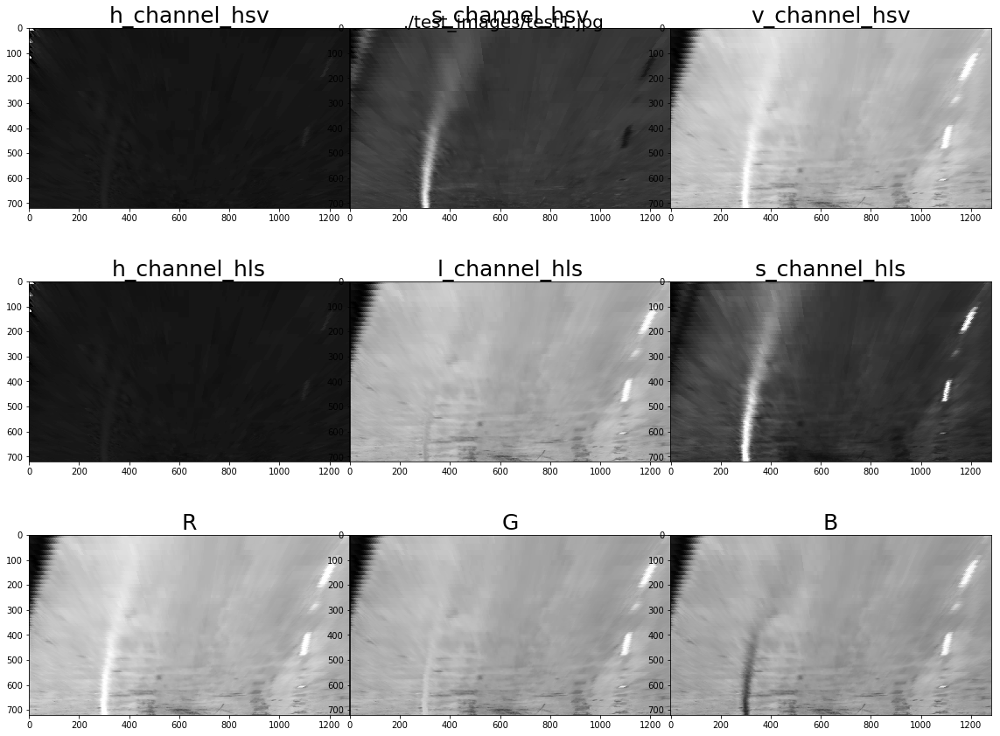
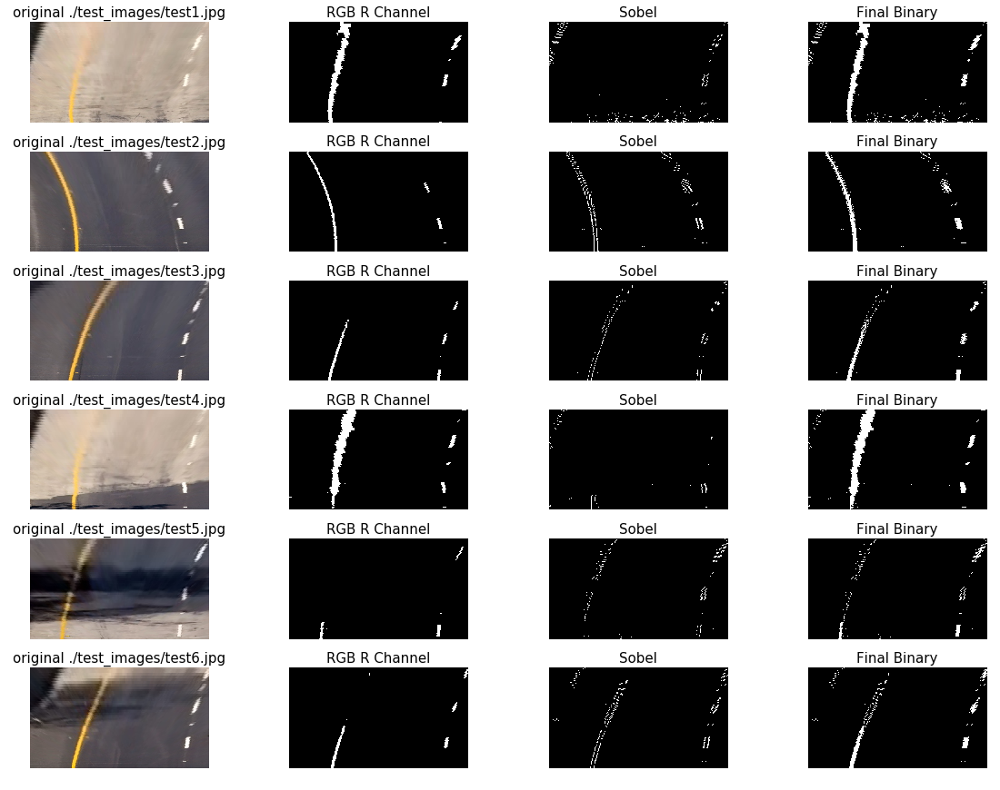

# Advanced Lane Finding

## The Project

The goals / steps of this project are the following:

* Compute the camera calibration matrix and distortion coefficients given a set of chessboard images.
* Apply a distortion correction to raw images.
* Use color transforms, gradients, etc., to create a thresholded binary image.
* Apply a perspective transform to rectify binary image ("birds-eye view").
* Detect lane pixels and fit to find the lane boundary.
* Determine the curvature of the lane and vehicle position with respect to center.
* Warp the detected lane boundaries back onto the original image.
* Output visual display of the lane boundaries and numerical estimation of lane curvature and vehicle position.

# Writeup

The notebook where all the code lives can be found [here](https://github.com/rkipp1210/advanced-lane-lines/blob/master/advanced-lane-detection.ipynb).

## Camera Calibration

### Chessboard images

There were test images provided that had various angles of the chessboard image on a wall. These images were fed into a pipeline which used the OpenCV function `findChessboardCorners` to find the corners of the chessboard. Like so:

```python
ret, corners = cv2.findChessboardCorners(gray, (9,6), None)
```

Where `gray` is the grayscale image of the chessboard, and `(9, 6)` are the number of horizontal and vertical squares in the chessboard. Here's the output of finding the chessboard corners on the images:


Note that if the images are blank, then the `findChessboardCorners` didn't return any points.

If the corners were found, they were added to a list of all the corners. The list of these image points and a list of the object points are passed into the `calibrateCamera` function to get the camera distortion coefficients. The matricies calculated here will be used throughout the rest of the project.

### Undistorting Images

We can then use the `cv2.undistort` function, passing in the camera matrix and the distortion matrix, on an image to calculate the undistorted image. Here's the helper function I wrote to do this:

```python
def undistort(img, mtx, dist):
    undist = cv2.undistort(img, mtx, dist, None, mtx)
    return undist
```

Here's an example of an original image, and an undistorted version of that image.


## Image Pipeline

### Perspective Transform

After we have the undistorted images, we can perform a perspective transform to get a birds-eye view of the lane lines. This will help us fit polynomials to the lines later. To perform the transform, I used the cv2 `getPerspectiveTransform` and `warpPerspective` functions to first calculate the transform matrix using source and destination points, the applying that transform to a given image. Here is the helper function I wrote that accomplishes that:

```python
def warper(img):

    # Points for the original image
    src = np.float32([
        [250, 675],
        [590, 450],
        [690, 450],
        [1055, 675]
    ])

    # Points for the new image
    dst = np.float32([
        [250, 750],
        [250, 0],
        [1035, 0],
        [1035, 750]
    ])

    # Compute and apply perpective transform
    img_size = (img.shape[1], img.shape[0])
    M = cv2.getPerspectiveTransform(src, dst)
    warped = cv2.warpPerspective(img, M, img_size, flags=cv2.INTER_NEAREST)  # keep same size as input image

    return warped
```

I tuned these source and destination points on straight lane test images. And here's what the output looks like on straight lines (with the points drawn):


And here's what those same points look like on curved lane lines:


### Threshold Binary Images

I spent a lot of time reviewing which color channels were the best at pulling out the lane lines in the test images. There are many examples of this work in the ipython notebook, but here's an example:



From studying these images, I eliminated a few options. I moved on to creating threshold binary images from the images that looked the best (HLS L and S channels, HSV V channel, and R from RGB). I was able to figure out how to make sliders to adjust the thresholds so I tuned the thresholding this way. I also did this with the Sobel operator and found that the X direction derivatives seemed the best. After running through many iterations I use the R from RGB and the Sobel X to generate my binary threshold image. Here's an example of that image pipeline:



The code for this can be found in the notebook.


### Finding Lane Line Pixels and Fitting

```
Describe how (and identify where in your code) you identified lane-line pixels and fit their positions with a polynomial?

Methods have been used to identify lane line pixels in the rectified binary image. The left and right line have been identified and fit with a curved functional form (e.g., spine or polynomial). Example images with line pixels identified and a fit overplotted should be included in the writeup (or saved to a folder) and submitted with the project.
```


### Calculating Corner Radius and Lane Center

```
Describe how (and identify where in your code) you calculated the radius of curvature of the lane and the position of the vehicle with respect to center.

Here the idea is to take the measurements of where the lane lines are and estimate how much the road is curving and where the vehicle is located with respect to the center of the lane. The radius of curvature may be given in meters assuming the curve of the road follows a circle. For the position of the vehicle, you may assume the camera is mounted at the center of the car and the deviation of the midpoint of the lane from the center of the image is the offset you're looking for. As with the polynomial fitting, convert from pixels to meters.
```


The radius of curvature is calculated using


### Final Product

Using all of the above functions to assemble the final pipeline gives this result:


## Video

```
Provide a link to your final video output. Your pipeline should perform reasonably well on the entire project video (wobbly lines are ok but no catastrophic failures that would cause the car to drive off the road!)

The image processing pipeline that was established to find the lane lines in images successfully processes the video. The output here should be a new video where the lanes are identified in every frame, and outputs are generated regarding the radius of curvature of the lane and vehicle position within the lane. The pipeline should correctly map out curved lines and not fail when shadows or pavement color changes are present. The output video should be linked to in the writeup and/or saved and submitted with the project.
```


## Discussion

```
Briefly discuss any problems / issues you faced in your implementation of this project. Where will your pipeline likely fail? What could you do to make it more robust?

Discussion includes some consideration of problems/issues faced, what could be improved about their algorithm/pipeline, and what hypothetical cases would cause their pipeline to fail.
```

My solution works well on the project video, but really shows some weakness on the more advanced videos. This leads me to believe that I could spend more time tuning which color channels and thresholds to use for my binary image creation, as it seems so struggle a little with some of the bright and shadowed areas.
