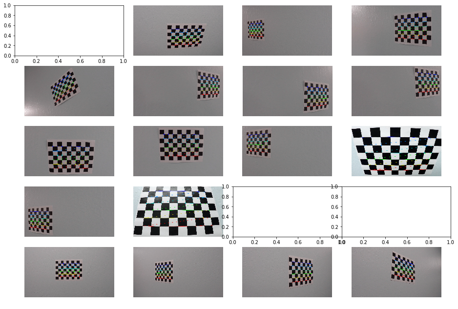

## Advanced Lane Finding

Creating a great writeup:
---
A great writeup should include the rubric points as well as your description of how you addressed each point.  You should include a detailed description of the code used in each step (with line-number references and code snippets where necessary), and links to other supporting documents or external references.  You should include images in your writeup to demonstrate how your code works with examples.  


The Project
---

The goals / steps of this project are the following:

* Compute the camera calibration matrix and distortion coefficients given a set of chessboard images.
* Apply a distortion correction to raw images.
* Use color transforms, gradients, etc., to create a thresholded binary image.
* Apply a perspective transform to rectify binary image ("birds-eye view").
* Detect lane pixels and fit to find the lane boundary.
* Determine the curvature of the lane and vehicle position with respect to center.
* Warp the detected lane boundaries back onto the original image.
* Output visual display of the lane boundaries and numerical estimation of lane curvature and vehicle position.


## Writeup

### Camera Calibration

#### Chessboard images

There were test images provided that had various angles of the chessboard image on a wall. These images were fed into a pipeline which used the OpenCV function `findChessboardCorners` to find the corners of the chessboard. Like so:

```python
ret, corners = cv2.findChessboardCorners(gray, (9,6), None)
```

Where `gray` is the grayscale image of the chessboard, and `(9, 6)` are the number of horizontal and vertical squares in the chessboard. Here's the output of finding the chessboard corners on the images:



Note that if the images are blank, then the `findChessboardCorners` didn't return any points.

If the corners were found, they were added to a list of all the corners. The list of these image points and a list of the object points are passed into the `calibrateCamera` function to get the camera distortion coefficients. The matricies calculated here will be used throughout the rest of the project.

#### Undistorting Images

We can then use the `cv2.undistort` function, passing in the camera matrix and the distortion matrix, on an image to calculate the undistorted image. Here's the helper function I wrote to do this:

```python
def undistort(img, mtx, dist):
    undist = cv2.undistort(img, mtx, dist, None, mtx)
    return undist
```

Here's an example of an original image, and an undistorted version of that image.


### Image Pipeline

#### Perspective Transform

After we have the undistorted images, we can perform a perspective transform to get a birds-eye view of the lane lines. This will help us fit polynomials to the lines later. To perform the transform, I used the cv2 `getPerspectiveTransform` and `warpPerspective` functions to first calculate the transform matrix using source and destination points, the applying that transform to a given image. Here is the helper function I wrote that accomplishes that:

```python
def warper(img):

    # Points for the original image
    src = np.float32([
        [250, 675],
        [590, 450],
        [690, 450],
        [1055, 675]
    ])

    # Points for the new image
    dst = np.float32([
        [250, 750],
        [250, 0],
        [1035, 0],
        [1035, 750]
    ])

    # Compute and apply perpective transform
    img_size = (img.shape[1], img.shape[0])
    M = cv2.getPerspectiveTransform(src, dst)
    warped = cv2.warpPerspective(img, M, img_size, flags=cv2.INTER_NEAREST)  # keep same size as input image

    return warped
```

I tuned these source and destination points on straight lane test images. And here's what the output looks like on straight lines (with the points drawn):


And here's what those same points look like on curved lane lines:


#### Threshold Binary Images

I spent a lot of time reviewing which color channels were the best at pulling out the lane lines in the test images. There are many examples of this work in the ipython notebook, but here's an example:
